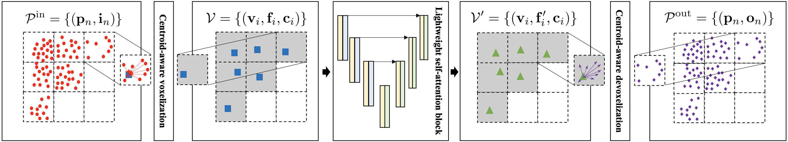

# [Fast Point Transformer](https://arxiv.org/abs/2112.04702)

 [Chunghyun Park](https://github.com/chrockey),
 [Yoonwoo Jeong](https://github.com/jeongyw12382),
 [Minsu Cho](http://cvlab.postech.ac.kr/~mcho/),
 [Jaesik Park](http://jaesik.info/) \
 POSTECH GSAI & CSE \
 in CVPR 2022

 <div style="text-align:center">
 
 </div>

 ### Overview

 The recent success of neural networks enables a better interpretation of 3D point clouds, but processing a large-scale 3D scene remains a challenging problem. Most current approaches divide a large-scale scene into small regions and combine the local predictions together. However, this scheme inevitably involves additional stages for pre- and post-processing and may also degrade the final output due to predictions in a local perspective. This paper introduces Fast Point Transformer that consists of a new lightweight self-attention layer. Our approach encodes continuous 3D coordinates, and the voxel hashing-based architecture boosts computational efficiency. The proposed method is demonstrated with 3D semantic segmentation and 3D detection. The accuracy of our approach is competitive to the best voxel based method, and our network achieves 129 times faster inference time than the state-of-the-art, Point Transformer, with a reasonable accuracy trade-off in 3D semantic segmentation on S3DIS dataset.

 ### Citing our paper

 ```BibTeX
@inproceedings{park2022fast,
  title={{Fast Point Transformer}},
  author={Chunghyun Park and Yoonwoo Jeong and Minsu Cho and Jaesik Park},
  booktitle={Proceedings of the {IEEE} Conference on Computer Vision and Pattern Recognition},
  year={2022}
}
```

## Acknowledment

Our code is based on the [MinkowskiEngine](https://github.com/NVIDIA/MinkowskiEngine) and [Torch Points3D](https://github.com/torch-points3d/torch-points3d).